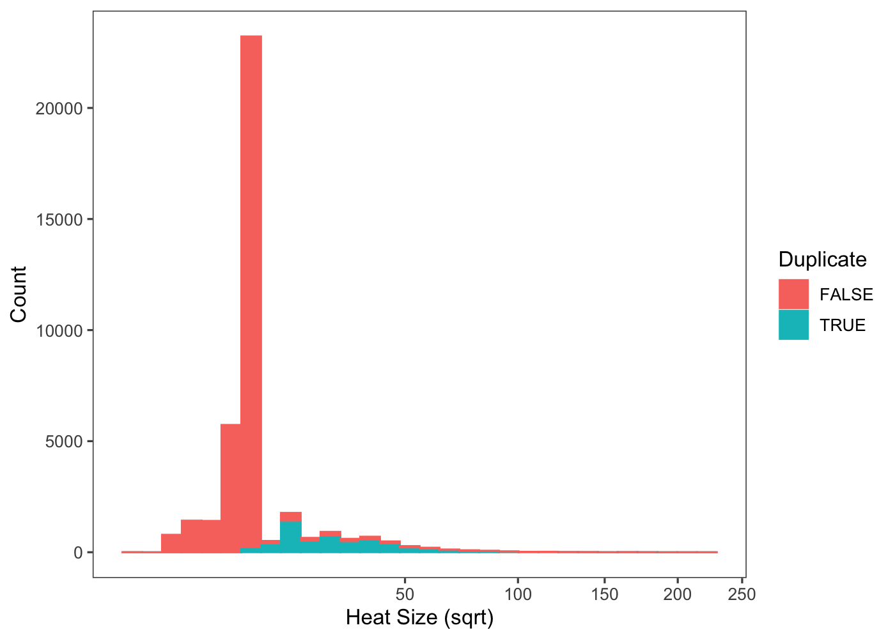
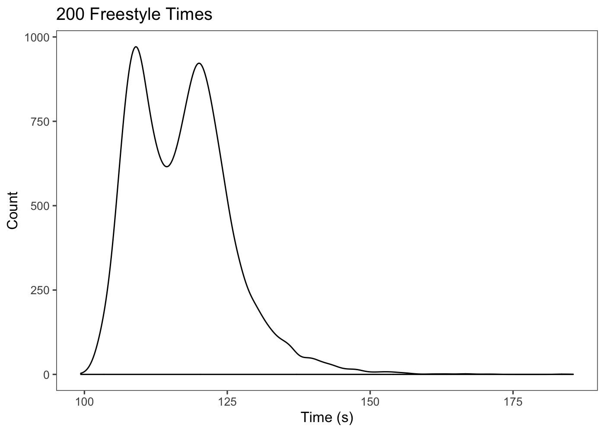
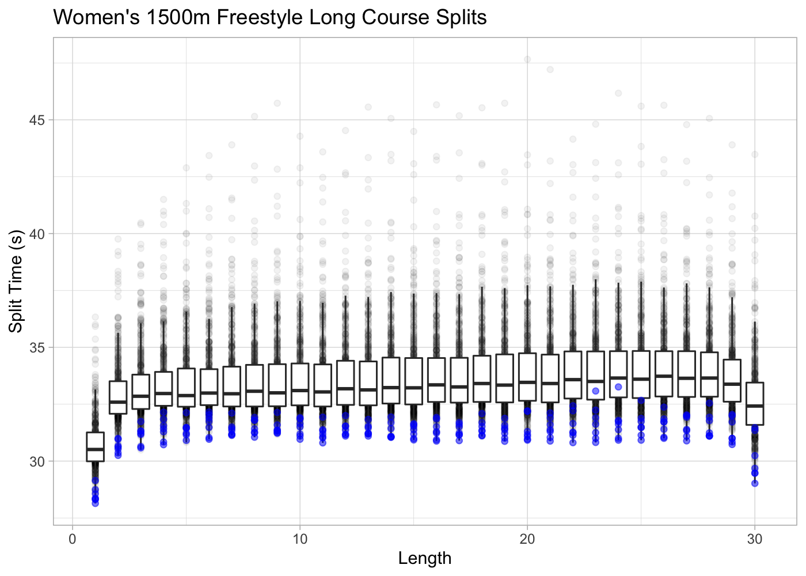
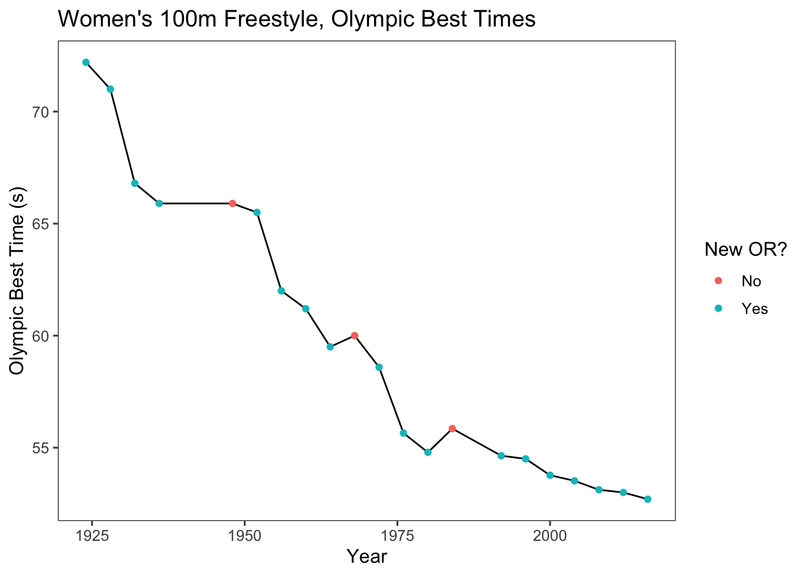
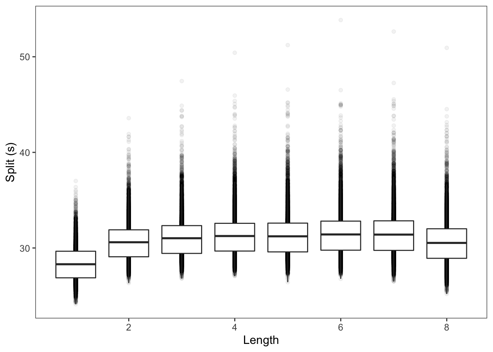
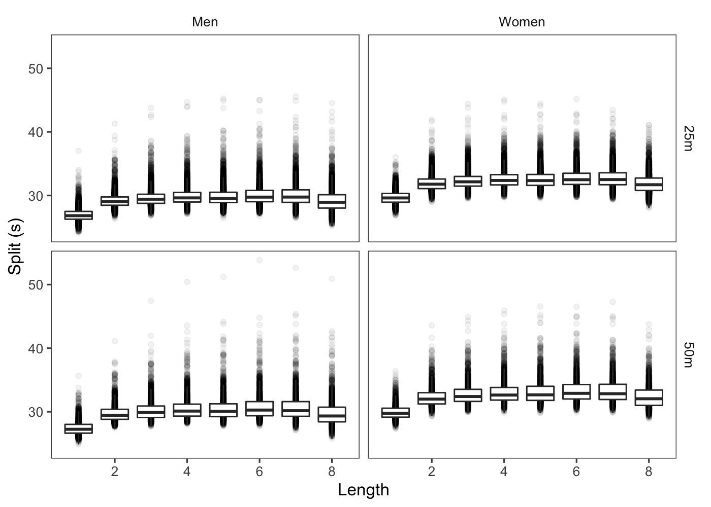
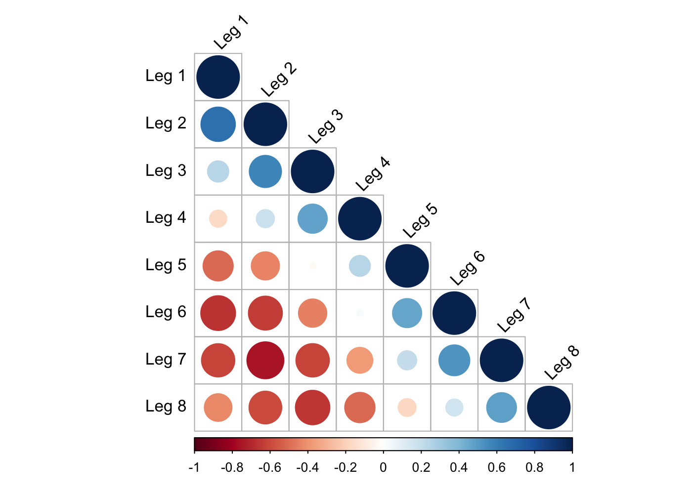
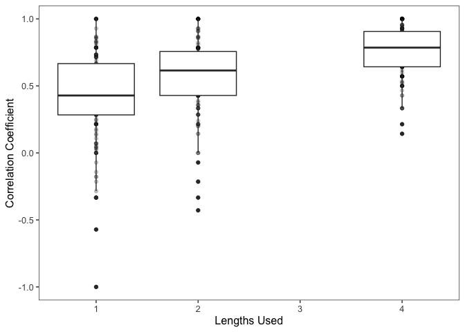

FINA Swim Competition Data
================
Andrew Hayes
10/10/2019

-   [Data Landscape](#data-landscape)
-   [Data Preparation](#data-preparation)
    -   [Crawling and Scraping](#crawling-and-scraping)
    -   [Tidying and Wrangling](#tidying-and-wrangling)
    -   [Duplicate Heats](#duplicate-heats)
    -   [Missing Splits](#missing-splits)
    -   [Identifying Athletes](#identifying-athletes)
-   [Data Overview](#data-overview)
-   [Case Study: 400m Freestyle Splits](#case-study-400m-freestyle-splits)
    -   [Exploratory Data Analysis](#exploratory-data-analysis)
    -   [Final Time Prediction](#final-time-prediction)
    -   [Heat Outcome Prediction](#heat-outcome-prediction)
-   [Conclusion](#conclusion)

This repository includes scripts for scraping, wrangling, and visualizing swim competition data from FINA's published meet results. Data was scraped to JSON format using Python's [scrapy](https://scrapy.org/) library, then loaded into an R workspace for cleaning and visualization with the [tidyverse](https://www.tidyverse.org/). Feel free to clone the repo to recreate visuals or pick out interesting trends, but be aware of the dataset's flaws described below.

Data Landscape
--------------

Multiple data sources were explored initially before settling on FINA's results published at fina.org. They are listed here in order of worst to best:

-   [sports-reference.com](sports-reference.com) has been used to source Olympic datasets in the past, for example the [Kaggle Olympic Dataset](https://www.kaggle.com/heesoo37/120-years-of-olympic-history-athletes-and-results). As of Summer 2019, most Olympic swimming results prior to 2012 are missing entirely, so it didn't serve well for this project.

-   [Wikipedia](https://en.wikipedia.org/wiki/Swimming_at_the_Summer_Olympics) has most of the results and in some cases, results older than the IOC's actual site. However, the data is not consistently formatted and the aggregation alone is a daunting task.

-   [Official Olympic results](https://www.olympic.org/olympic-results) are available on the the International Olympic Committee's (IOC) website, for all sports. This was the first data source evaluated and scraped, but in the course of data cleaning it was found inadequate for analysis. First, there were omited heats, most notably some "Final A" heats for games in the 1980's and 90's Olympics. When the final heat is missing, there is no way to tell who won gold or the best times for that event. Second, although this may have been fixed by the time of writing, there were duplicate entries and profiles for certain athletes with multi-part last names like Chad Le Clos.

-   [swimrankings.net](https://www.swimrankings.net/), arguably the best for recent data, is a crowdsourced result database. Swimmers and coaches are encouraged to log in to update their times. Unlike the FINA data, swimmers are uniquely ID'd. The dataset was the basis of [Tanyoung Kim's analysis](https://towardsdatascience.com/data-visualization-of-elite-swimmers-competition-results-part-1-datasets-bd09b68154c2) on Towards Data Science. It contains several meets that FINA does not have, like the Pan American Championships, Commonwealth Games, and European Championships, although not all of FINA's 25m Championship data. Unlike FINA data, it does not contain preliminary and semifinal data within their respective heats, instead all results from each phase of the competition are grouped together. Ultimately, this data was not used because the site's `robot.txt` prohibits scraping.

-   FINA (Fédération internationale de natation) is the international body governing swimming. They host the World Championships every other year and also play an important role in the Olympics. FINA also hosts the 25m World Championships, Junior World Championships, Champion Series and World Cup. Data for FINA hosted meets is available at [fina.org](fina.org) and is fairly consistently formatted. The focus of the data cleaning and exploratory data analysis below is the FINA data.

Data Preparation
----------------

### Crawling and Scraping

fina.org was scrawled with a basic scrapy *CrawlSpider* that started from the [overall results list](http://www.fina.org/discipline/swimming/results) and paginated throught the list while following each meet link. From each [meet result page](http://www.fina.org/competition-results/53c913aa-b0d6-446d-86a7-5f3190ff16a9/45/46835), each event link was followed and results were scraped from those pages. Event metadata (url, competition name, dates, title, location, ... ), heat metadata (date, html id, name), and results (time, name, notes, place, rank, points, splits) were scraped from the page and passed to the scrapy pipeline as JSON blobs. Download delay on the spider was set to a generous ten seconds, as required by the *robots.txt* to avoid putting any strain on the site. With the delay, the entire site was scraped in a few hours to a JSON file.

### Tidying and Wrangling

The JSON file was imported in R with the *jsonlite* library. Immediately after import, the raw data was saved as an R object to file should someone want to work from that as a starting point (a smaller file than the raw JSON). The next, standard wrangling steps involved unnesting the data and converting fields to appropriate data types:

-   results were converted to seconds, in decimals
-   event titles were separated into distance, stroke, and gender variables
-   events were classified by pool type and competition series
-   results and heats were given unique ID's
-   other scraped metadata was converted to appropriate types

There were three overarching issues that had to be addressed specially: duplicate heats/results, missing splits, and athelete identification.

### Duplicate Heats

The FINA website often lists results twice - once in a list of results within that heat only, and once in a preliminary or semifinals summary. For example, if 80 people swam in a 100m Freestyle preliminary then there may be 160 results: ten 8-person lists, one for each heat, and a summary 80 person list. The summaries are used inconsistently. Sometimes there is [only a summary](http://www.fina.org/competition-detailed-results/148808), sometimes only heats, sometimes [both](http://fina.org/competition-detailed-results/142757). Some are [especially wacky](http://fina.org/competition-detailed-results/149251). The labels and HTML ID's of the heats are not consistent enough to differentiate.

The ideal would be to keep heat data only and remove summary data, except where only summary data exists. Duplicate results within events were identified as those that shared the same first name, last name, country, and time as another result in a smaller heat. Thus if there are two, the summary would be marked as a duplicate but the original would not. This is a very low bar for duplicates - if a swimmer got the same time in prelims and finals that would also be marked as a duplicate. So the duplicates were not removed directly but rather used to compute the proportion of results in each heat. A heat with mostly probable duplicates is probably a duplicate, and a heat wih no possible duplicates is probably unique. The empirical CDF of these proportions is shown here:


The distribution of duplicate probabilities is very close to the ideal. Most phases have a near 0 or near 1 probability of being duplicate. The majority of heats are near 0 probability which is as expected when we are prioritizing small, actual heats over summary heats. After manually inspecting those handful of middle cases, the best cutoff seemed to be .5, meaning anything with less than a .5 proportion of possible duplicates was kept. Most of the middle cases seem to have issues with [duplicate data](http://www.fina.org/competition-detailed-results/154566) across prelims, semis, and finals rather than only across heat and summaries.

We end up removing 5504 heats with 33617 remaining but, because the removed were on average bigger heats, it is actually 37% of the original 447222 results. When we plot the density of heat sizes, split by duplicates and non-duplicates, we can see we're keeping most small, pool-sized heats and discarding only larger ones.



### Missing Splits

Most results had accompanying splits, specifically 183422 out of 281310 results . Some results (&lt;10%) were missing a single, final split. These were identified by inspecting the difference between number of actual and expected splits, the difference between the actual and expected sum of the splits, and the position of the missing split. When only one final split was missing, the final split was interpolated from the rest as the difference between the actual and expected sum of splits.

Of the results without splits, most (&gt;99%) simply had no data available from FINA. The other missing were of two types. Some were missing a final time due to disqualification or data anomaly, so the splits couldn't be validated against the final time. Others were due to [missing middle splits](https://www.fina.org/competition-detailed-results/141618/24504) (see KALMAR) or split times [not adding up](https://www.fina.org/competition-detailed-results/148629) (see USA) to the final time.

### Identifying Athletes

The main limitation of the FINA dataset is that athletes are not uniquely ID'd. Results are identified to athletes only by first and last name. Because some swimmers do share the same first and last name, it's nearly impossible to cleanly identify different swimmers. Thus features like length of career, events per career, etcetera are not reliable. There are some features that could be used to separate swimmers with shared names as separate athletes:

-   Country, but there is no guarantee a swimmer's country is constant and shared names are often within countries.
-   Long gaps in careers, but older swimmers coming back for the "Marathon Series," for example, is quite common. Also, this does not help differentiate contemporaneous swimmers.
-   Different events and times, but swimmers often swim multiple events, distances, and strokes

Attempting to differentiate swimmers, especially without a test set, would be very difficult to do with accuracy. For the current project, I opted to not try to ID athletes, and continue with the knowledge that name-based identification is very flawed with the FINA data.

Data Overview
-------------

What data has FINA made available to us, and what is it's quality? Each competition was classified into one of eight series:

``` r
# Pull data set into "ws", my working set
ws <- fina_join() %>%
  mutate(comp_id = as.factor(paste(competition, location_name, start_day, start_month)))

ss <- ws %>% group_by(series) %>% 
  summarize(start_year = min(year),
            recent_year = max(year),
            n_comp = length(unique(comp_id)),
            n_event = length(unique(event_id)),
            n_phase = length(unique(phase_id)),
            n_result = n()) %>%
  arrange(desc(n_comp))

ss %>% 
  kable(format = "markdown", col.names = 
          c("Series", "Start Year", "Last Year","Meets", "Events",
            "Heats", "Results"))
```

| Series               |  Start Year|  Last Year|  Meets|  Events|  Heats|  Results|
|:---------------------|-----------:|----------:|------:|-------:|------:|--------:|
| World Cup            |        1988|       2019|    242|    8122|  20113|   158428|
| Olympic Games        |        1924|       2016|     21|     474|   3275|    23944|
| Championships (50m)  |        1973|       2019|     18|     649|   4394|    42455|
| Championships (25m)  |        1993|       2018|     14|     554|   3466|    32002|
| Junior Championships |        2006|       2019|      7|     288|   1558|    17722|
| Champions Series     |        2019|       2019|      3|      90|     90|      360|
| Youth Olympic Games  |        2010|       2018|      3|     104|    630|     4655|
| Marathon Series      |        2018|       2018|      1|      31|     86|     1744|

In total there are 309 competitions, 10312 events, 33612 heats, 281310 results in the dataset, with the majority belonging to the World Cup or the better known Olympics or World Championships. The World Cup accounts for more than 50% of all results because every year of the World Cup, e.g. "Swimming World Cup 2019," consists of a series of meets held at different dates and different locations across the globe. While the numbers of meets and events above are reliable, the numbers of heats and results are not. The deduplication process described previously is not perfect and doesn't account for outlier data formats.

Each competition has a set of events like Women's 50 Backstroke, Men's 200 Medley Releay, and so on. Most meets have between 20 and 50 different events. The competitions with the least events are the result of older meets, especially early Olympics, when fewer events were commonly swum and competed in. Because of the differences between competitions over time, different strokes and distances will have differing amounts of data. For example, the Men's 50 Freestyle has been swum in nearly every meet since 1924, but the Mixed Relays are a new addition with very little data.

Each event, in turn, has a series of heats. The heats could be a combination of preliminary, semifinal, final, or swim-off heats. Some have no semifinals, only finals, or only summaries. Heats are either true heats or summaries, meaning they represent a group of swimmer results who were in the pool together racing or the combination of all results in that level (prelims, finals, etc.). This is an important distinction, because for true heats we can look at effects of swimmers competing against one another and in summaries we are not able.

Not every result is usable for an analysis of times or performance because some are actually disqualificaitons or races that were never swum, categorized in the *status* attribute:

-   TIME = time exists
-   DNS = did not start
-   DSQ = disqualified
-   ? = time displayed as "?" by FINA
-   OTHER = does not fit into another category
-   DNF = did not finish

After filtering out non-time results, distributions of a given event's time can be visualized. For example, here are the results of all 200m Freestyle results:

``` r
ws %>% 
  filter(status == "TIME", distance == 200, style == "Freestyle", !relay) %>%
  ggplot(aes(time, stat(count))) +
  geom_density() + 
  labs(x = "Time (s)", y = "Count") + 
  theme +
  ggtitle("200 Freestyle Times")
```



The plots of all times of a given event are usually bimodal due to gender differences and, to a lesser extent, 25m vs 50m pool differences. As such, I recommend faceting on pool length and gender in most analyses:

``` r
ws %>% 
  filter(status == "TIME", distance == 200, style == "Freestyle", !relay) %>%
  ggplot(aes(time, stat(count))) +
  geom_density() + 
  labs(x = "Time (s)", y = "Count") + 
  theme + 
  facet_grid(gender ~ pool) +
  ggtitle("200 Freestyle Times (by pool and gender)")
```


Split data gives a much richer picture of each race. To use the data, joi the result data with the separate splits data frame on *result\_id*. Not all races have splits available, so some races won't be included after an inner join. As an example, below we can see the distribution of splits for the individual Women's 1500m Freestyle in long course (with one of my favorite swimmers, Katie Ledecky, highlighted):

``` r
splits_ex <- splits %>% 
  inner_join(ws, by = "result_id") %>% 
  filter(distance == 1500, split_distance == 50, pool == "50m", gender == "Women")

kl <- splits_ex %>% 
  filter(family_name == "LEDECKY")
  
splits_ex %>% 
  ggplot(aes(leg, split, group = leg)) + 
  geom_point(alpha = .05) + 
  geom_boxplot(outlier.shape = NA) + 
  theme_light() + 
  geom_point(data = kl, color = "blue", alpha = .5) + 
  labs(x = "Length", y = "Split Time (s)") +
  ggtitle("Women's 1500m Freestyle Long Course Splits")
```



In a FINA hosted meet, Katie Ledecky has never swam a split of her 1500m Freestyle slower than the median split time of the dataset. This example demonstrates that, although the dataset does not uniquely identify athletes to calculate career features, individual athletes can be examined by first name, last name, and/or country.

The three figures above show race results independent of year, but the progression of race results over time is one of the most interesting aspects of the dataset. The dataset cannot be used to track World Records, as those are often made outside of the meets in the dataset, but can be used to track Olympic Records, e.g. for the Women's 100 Freestyle:

``` r
# Compile time series of best time from each year at the Olympics
ts <- ws %>% filter(series == "Olympic Games") %>%
  filter(distance == 100, style == "Freestyle", gender == "Women", status == "TIME" ) %>%
  group_by(year) %>%
  summarise(best = min(time)) %>%
  arrange(year) %>%
  mutate(
    or = cummin(best),
    or_diff = best - lag(or),
    `New OR?` = if_else(or_diff < 0 | is.na(or_diff), "Yes", "No")
  )

ts %>% ggplot(aes(x = year, y = best)) + 
  geom_line() + 
  geom_point(mapping = aes(color = `New OR?`)) +
  theme + 
  labs(x = "Year", y = "Olympic Best Time (s)") + 
  ggtitle("Women's 100m Freestyle, Olympic Best Times")
```



There are many different directions an investigation of this dataset could take. In the below case study, I've delved deeper into the relationship between race splits. Other possible avenues of investigation include:

-   tracking athlete times over the course of their observable career
-   when athletes swim multiple events in their career, are those clusterable patterns or random?
-   relative success of each country year to year at Olympics or World Championships
-   how split distributions vary from event to event, by distance and stroke
-   etc.

Case Study: 400m Freestyle Splits
---------------------------------

### Exploratory Data Analysis

Here, I take a deeper look at the split data for the 400m Freestyle and how the splits are predictive of one another.

To start, let's visualize the distribution of splits by race leg:

``` r
cs_style <- "Freestyle"
cs_distance <- 400
cs_splits <- splits %>% 
  inner_join(ws, by = "result_id") %>% 
  filter(distance == cs_distance, style == cs_style, split_distance == 50, !relay) 
  
cs_splits %>% 
  ggplot(aes(leg, split, group = leg)) + 
  geom_point(alpha = .05) + 
  geom_boxplot(outlier.shape = NA) + 
  theme + 
  labs(x = "Length", y = "Split (s)")
```



Some trends are immediately apparent from the 11010 races above. Of all the race legs, the first is the fastest and the second and last are also faster than the median. Throughout the race, split times are mostly non-decreasing until the last 50, which is slightly faster than the second-to-last. The variation above is slightly exagerated because it includes Men and Women together, and 25m and 50m pools together. When accounting for these features of a race we notice much less variation:

``` r
cs_splits %>% 
  ggplot(aes(leg, split, group = leg)) + 
  geom_point(alpha = .05) + 
  geom_boxplot(outlier.shape = NA) + 
  facet_grid(pool ~ gender) +
  theme + 
  labs(x = "Length", y = "Split (s)")
```



Above it is still difficult to differentiate variation due to *overall* time and split variation. For example, maybe everybody paces in the same way but person A's splits are consistently 2% faster than person B. Recreating the plot with proportions of the final time, rather than actual times, allows us to better visualize variation in how the race is paced.

``` r
cs_ratios <- cs_splits %>% 
  mutate(ratio = split/time) 

cs_var <- cs_ratios %>%
  group_by(leg) %>%
  summarise(s = sd(ratio))

p <- cs_ratios %>%
  ggplot(aes(leg, ratio, group = leg)) + 
  geom_point(alpha = .05) + 
  geom_boxplot(outlier.shape = NA) + 
  geom_hline(yintercept = 1/8, linetype = "dotted") +
  theme + 
  labs(x = "Length", y = "Ratio of Overall Time")

p + 
  geom_line(data = cs_var, mapping = 
              aes(x = leg, y = s*50, group = "SD"), color = "blue") +
  geom_point(data = cs_var, mapping = 
              aes(x = leg, y = s*50, group = "SD"), color = "blue")
```


In the plot above, the dotted horizontal line represents the average split of a race and the blue line is the scaled (x50), standard deviation of each length. It seems the middle four lengths are particularly stable, but swimmers vary more than double in the first and final lengths. Are some swimmers more weighted toward the front, and others toward the end? What are the relationships between each lap? The correlation matrix provides some insight into how the split ratios are related, using the package *corrplot*:



The overall trend of the plot is that legs close together are positively correlated and legs further apart are negatively correlated. The interesting bit is that it is not a completely uniform trend. If it were, we would expect the first and last split to be the most negatively correlated but this is not the case - it is the second and second-to-last splits which are most negatively correlated. It seems that the final length is more resilient. Going out very fast (relative to your eventual time) in the initial 100 is normally reflected in relatively slower splits between the 250 and 350 mark, less so the final length.

### Final Time Prediction

``` r
cs_obs <- cs_splits %>%
  filter(gender == "Women", pool == "50m") %>%
  select(result_id, leg, time, split) %>%
  pivot_wider(names_from = leg, values_from = split, names_prefix = "leg")
```

How predictive of final time are a race's initial splits? If we see the initial leg(s) of a race, how closely can we predict the final time? Because of the variations due to pool type in gender, this analysis is further limited to only Women's Long Course 400m Freestyle. After the 50-, 100-, or 200-meter mark, how well can we predict the final time? I divide the dataset containing 1457 races into a training set with 80% of the races and a test set with the other 20%. Our baseline model is just predicting final times in the test set as the average of final times in the train set - our model if we had no splits available and were using no other features. For a measure of accuery I use RMSE:

``` r
set.seed(1)
train_index <- createDataPartition(cs_obs$time, p = .8, list = FALSE)
cs_train <- cs_obs[train_index,]
cs_test <- cs_obs[-train_index,]

train_mu <- mean(cs_train$time)
rmse0 <- RMSE(cs_test$time, train_mu)
rmse0
```

    ## [1] 14.05248

#### Prediction with One Split

In this first model, we attempt to predict the final time as a linear model of the first, with first one and then two degrees:

``` r
# Simple Regression
fit1 <- train(time ~ leg1, data = cs_train, method = "lm")
pred1 <- predict.train(fit1, newdata = cs_test)
rmse1 <- RMSE(pred1, cs_test$time)
rmse1
```

    ## [1] 5.362668


The first split is significantly predictive as expected - faster swimmers begin the race faster - so the reduction in RMSE was more than 50%, from 14.0524826 to 5.3626677 for the linear regression.

#### Prediction with Two Splits

One fourth of the race in, with a second split, we have significantly more to play with because not only do we have the time so far, but the change in pace between the first and second lengths. Thus our model has two features, the first and second splits. At first I repeat a simple linear model using leg 1 and leg 2, but here I also try other models within the caret framework, in case the better capture the interaction between the two times:

``` r
# Linear Regression Model
fit2_lm <- train(time ~ leg1 + leg2, data = cs_train, method = "lm")
pred2_lm <- predict.train(fit2_lm, newdata = cs_test)
rmse2_lm <- RMSE(pred2_lm, cs_test$time)
rmse2_lm
```

    ## [1] 3.364983

``` r
# K-nearest Neighbors
fit2_knn <- train(time ~ leg1 + leg2, data = cs_train, 
                  method = "knn", tuneGrid = data.frame(k = seq(3,51,2)))
pred2_knn <- predict.train(fit2_knn, newdata = cs_test)
rmse2_knn <- RMSE(pred2_knn, cs_test$time)
rmse2_knn
```

    ## [1] 3.609404

``` r
# Random Forest
fit2_rf <- train(time ~ leg1 + leg2 , data = cs_train, 
                  method = "rf", tuneGrid = data.frame(mtry = c(1,2)))
pred2_rf <- predict.train(fit2_rf, newdata = cs_test)
rmse2_rf <- RMSE(pred2_rf, cs_test$time)
rmse2_rf
```

    ## [1] 3.620417

``` r
rmse2 <- min(rmse2_lm, rmse2_knn, rmse2_rf)
```

The k-nearest neighbors and random forest algorithms perform worse on the data than a simple linear regression. The reason for this, I suspect, is that the data is best fit by regression rather than other ML algorithms because the predictors and the outcome are all smooth, roughly normally distributed continous variables.

#### Prediction with Four Splits

Since our linear regression was our strongest model at the 100-meter mark, for 200m we do the same:

``` r
# Linear Regression Model (2 Degrees of Each Variable)
fit4 <- train(time ~ leg1 + leg2 + leg3 + leg4, data = cs_train, method = "lm")
pred4 <- predict.train(fit4, newdata = cs_test)
rmse4 <- RMSE(pred4, cs_test$time)
rmse4
```

    ## [1] 1.841535

After having made predictions and calculated accuracies for the three points in the race under consideration - 50m, 100m, 200m - we can see how progessive splits give us more predictive power for the final time.

``` r
rmses <- data.frame(legs_used = c(0,1,2,4), rmse = c(rmse0, rmse1, rmse2, rmse4))
rmses %>% ggplot(aes(x = legs_used, y = rmse)) +
  geom_line() + geom_point() + 
  labs(x = "Lengths Used", y = "RMSE") + 
  theme
```


### Heat Outcome Prediction

When we take the split predictions at the 50-,100-, and 200-meter marks and apply them to actual heats, how well can we predict the outcome of the heats? To do so, we can only use the results which are part of actual heats. Then we can compare the actual times and the predicted times by their [Kendall rank correlation coefficient](https://en.wikipedia.org/wiki/Kendall_rank_correlation_coefficient), a measure of the distance between two ordered lists, to get a sense of how incorporating more lengths into our prediction affects our prediction of the ranking:



In the plot above, 1 means that the outcome of the heat was predicted perfectly, -1 means the most wrong possible prediction, and 0 an average or random prediction. A more digestible summary of the data is our ability to simply guess the winner. After 50m, 100m, and 200m the model predicts the winner with 48%, 55%, and 68% respectively.

Conclusion
----------

There were three main parts of this project: 1. Understanding [fina.org](fina.org) results and scraping with [finaspider.py](/finacrawler/finacrawler/spiders/finaspider.py) 2. Wrangling the data to a usable format in [finawrangler.R](/finawrangler.R) 3. Performing exploratory data analysis, including a deeper dive in the case study detailed above

Part 2 revealed the good, the bad, and the ugly about the dataset. The dataset is large at over 200,000 unique results and covers many years and various competition series. It offers a window into swimming performance at the highest level. The inconsistent formatting of heats makes comparisons across prelimaries, semifinals, and finals difficult and introduces a lot of duplicates (most of which were removed). The splits are inconsistently formatted as well and not always included, but in most cases were clean enough to be included in the dataset. Athlete identification, however, is the great weakness of the dataset. Unlike [swimrankings.net](swimrankings.net) which has athlete pages and unique ID's, FINA only has first and last names. It would also be nice to have a broader dataset with access to non-FINA hosted competition series like the Pan American Championships and others.

In Part 3 the data is finally explored and some example visualizations reveal the patterns - in splits, results, and longitudinally - that can be found in the data. The deep dive into 400m splits doesn't reveal anything particularly shocking but demonstrates the predictive power of simple linear regressions on the outcome of the race. After 100m of the race, in over 50% of heats we can already predict the eventual winner without any additional background information on the swimmers or their other races. Also, there was the interesting observation that front-end heavy races (that is, races that are disproportionately fast in the first two lengths) suffer not in the final length as much as the third- and second-to-last lengths.

Thanks for reading (if you are crazy enough to be reading this...) and please take advantage of the dataset if you're interested in swimming results!
